<div align="center">

# CardSheet

**把若干图片拼成一张可打印的大图：7 种纸张预设 · 毫米级间距与裁切线 · 一张卡片自动铺满整页，打印后按格裁切**

[](https://github.com/techysy/CardSheet/releases/latest)
[](https://github.com/techysy/CardSheet/actions/workflows/ci.yml)
[](https://github.com/techysy/CardSheet/releases)
[](https://www.npmjs.com/package/@techysy/cardsheet)
[](#快速开始)
[](https://nodejs.org/)
[](LICENSE)

[功能](#功能) · [快速开始](#快速开始) · [命令行选项](#命令行选项) · [版面求解](#版面求解) · [命令行 API](#命令行-api) · [测试](#测试) · [更新日志](CHANGELOG.md)

</div>

> **典型场景**：一张卡片设计（饮品介绍、名片）要打印后拆成一小张一小张 —— 用 `--repeat` 让它铺满整张 A4，打印、沿裁切线一刀切下去就是成品。
>
> 单一运行时依赖 [sharp](https://sharp.pixelplumbing.com/)，零配置、零服务，单条命令出图。

---

## 功能

**纸张与分辨率**
- **7 种纸张预设**：A4 / A5 / A3 / B5 / 4×6 / 5×7 相纸 / 标准名片（86×54mm），也可 `--sheet 210x297` 直接给毫米。
- **打印级输出**：默认 300 dpi，可调 36–1200 —— 名片小字、照片放大都够用。
- **横竖版切换**：`--landscape` 一键横放，版面自动重算。

**排版与拼版**
- **四种排布给法**：固定单元格、固定行列、单向推算、全自动「每页塞最多」，详见[版面求解](#版面求解)。
- **毫米进、像素算**：对外全是毫米，引擎内部只做一次 `mm2px` 换算，杜绝舍入误差在几何里累积。
- **自动分页**：图多于一页时自动切 `sheet.png` / `sheet-2.png` / `sheet-3.png`…，不用自己算页数。
- **单图铺满**：`--repeat` 用第一张图铺满整页 —— 同一张卡片拼版的标准做法。

**裁切与成品质感**
- **裁切线**：`--cutlines` 在间距正中画浅灰实线，线宽随 dpi 缩放（约 0.17mm），打印可见、裁得准。
- **自适应留白**：横图 / 竖图自动 `contain` 居中进单元格，多出的部分填成页面底色，不会拉伸变形。
- **参数写错就报错**：`--cols abc`、裸写 `--cols`、`--margin` 大到版面不足，都会直接报错 —— 不会静默换一套版面，更不会输出一张全白的纸。

---

## 快速开始

**免安装**

```bash
npx @techysy/cardsheet card.png --paper a4 --repeat --cutlines
```

**全局安装**

```bash
npm install -g @techysy/cardsheet

# 一张饮品卡片铺满 A4，带裁切线（300dpi 打印级）
cardsheet card.png --paper a4 --repeat --cutlines

# 3 张样片按顺序排进 4×6 相纸（横放）
cardsheet p1.png p2.png p3.png --paper 4x6 --landscape --gap 3

# A4 摆 2×5 张 86×54mm 名片
cardsheet front.png --cell 86x54 --paper a4 --cols 2 --rows 5 --cutlines
```

**源码运行**

```bash
git clone https://github.com/techysy/CardSheet.git
cd CardSheet
npm install
node bin/cardsheet.js card.png --paper a4 --repeat --cutlines
```

要求 Node.js ≥ 20.9。

---

## 命令行选项

```
cardsheet <图片...> [选项]
```

| 选项 | 说明 |
| --- | --- |
| `--paper a4` | 纸张预设：`a4 / a5 / a3 / b5 / 4x6 / 5x7 / card`（名片 86×54mm） |
| `--sheet 210x297` | 直接指定纸张尺寸（毫米），优先于 `--paper` |
| `--landscape` | 纸张横放 |
| `--dpi 300` | 输出分辨率（默认 300，打印级；有效范围 36–1200） |
| `--cols 2` | 每行个数（正整数） |
| `--rows 5` | 每列（每页）行数（正整数） |
| `--cell 86x54` | 固定单元格尺寸（毫米），行列数按纸张反推 |
| `--gap 2` | 单元格间距（毫米，默认 2） |
| `--margin 5` | 页边距（毫米，默认 5） |
| `--repeat` | 用第一张图铺满整页（同一张卡片拼版） |
| `--cutlines` | 在间距正中画浅灰裁切线 |
| `--format png` | 输出格式 `png` / `jpeg`（默认 png） |
| `--quality 90` | jpeg 质量 |
| `--prefix sheet` | 输出文件名前缀（多页自动 `-2`、`-3`…） |
| `-o 目录` | 输出目录（默认当前目录，不存在会创建） |

### 版面求解

`--cols / --rows / --cell` 三者的给法决定求解顺序，按下面的优先级短路：

| 给法 | 行为 | 适用 |
| --- | --- | --- |
| `--cell 86x54` | 单元格固定，行列按可用版面反推 | 尺寸优先：裁出来必须和设计稿一比一 |
| `--cols 2 --rows 5` | 行列固定，单元格平分版心 | 版面优先：图之间的差异由 contain 留白吸收 |
| 只给 `--cols` 或 `--rows` | 另一边按首图宽高比推 | 「每行 3 张，行数你定」 |
| 都不给 | 枚举列数，取每页张数最多的方案（并列取列少者） | 只想「一页多塞几张」 |

全自动模式限制单元格最窄 15mm —— 否则一张横图会被排成 1×20 这样的畸形版。

### 关于双面打印

`--repeat` 只使用**第一张**图铺满整页，命令行里传的其余图片会被忽略。正反面各一页要跑两次：

```bash
cardsheet front.png --cell 86x54 --paper a4 --cols 2 --rows 5 --cutlines --prefix front
cardsheet back.png  --cell 86x54 --paper a4 --cols 2 --rows 5 --cutlines --prefix back
# 双面打印时选中「翻转」/「长边翻转」
```

---

## 命令行 API

CLI 层不认识毫米，引擎层不认识文件系统 —— `buildSheets` 进出都是 `Buffer`，中间不碰磁盘，因此能直接嵌进 Web 服务、Electron 或别的 CLI 而不必改一行。

```js
const { buildSheets, resolvePaper, PAPERS, mm2px } = require('@techysy/cardsheet');

const r = await buildSheets({
  images: [{ buffer, name }],   // 必填，顺序即排布顺序
  paper: 'a4',                  // 预设名 或 '宽x高'（毫米）
  dpi: 300,
  landscape: false,
  cols: null, rows: null, cell: null,
  gap: 2, margin: 5,            // 毫米
  repeat: false, cutlines: false,
  background: '#ffffff',
  format: 'png', quality: 90,
});
```

返回：

```js
{ pages,          // Buffer[]，pages[0] 是第 1 页
  pageW, pageH,   // 画布像素
  cols, rows,     // 网格
  cellW, cellH,   // 单元格像素
  perPage, pageCount,
  dpi }
```

`cellW / cellH` 是像素；反算毫米用 `cellW / dpi * 25.4`。另外还导出 `resolvePaper` / `PAPERS` / `mm2px`，方便自己拼版面。

### 架构

<div align="center">

<picture>
  <source media="(prefers-color-scheme: dark)" src="docs/architecture.svg">
  
</picture>

</div>

---

## 项目结构

```
bin/cardsheet.js       CLI 入口：参数解析 → 调引擎 → 写文件 → 打印摘要
src/sheet.js           排版引擎，全部逻辑（~170 行）
test/smoke.js          冒烟测试：引擎直调 5 组 + CLI 全链路 1 组，逐像素断言
scripts/build-diagrams.mjs   由 docs/architecture.md 生成 docs/*.svg
scripts/release-check.sh     发版前审查（本地与 CI 跑同一份脚本）
docs/architecture.md   架构文档与 Mermaid 图源码
```

---

## 测试

```bash
npm test
```

测试不比对图片快照，而是**读像素断言**：裁切线落在间距正中、该处颜色是浅灰 `#c8ccd2`；contain 居中后格子角落是留白、中心是内容；多图超量按 `perPage` 分页。
这样几何改错了会立刻失败，而不会因为编码器版本差异产生假阳性。

CI 在每次 push 到 `main` 和每个 PR 上跑，矩阵覆盖 Ubuntu/Windows × Node 20/22。
发版时 `release.yml` 额外把打包出的 tgz 装进 **Ubuntu / Windows / macOS 三个干净环境**各跑一次真实拼版（sharp 的平台二进制由 registry 按当前平台自动解析，这一步验的就是它），三平台全过才创建 GitHub Release。

---

## 已知限制

- **`--repeat` 只用第一张图**：其余传入的图片会被忽略，双面打印请分两次跑（见[关于双面打印](#关于双面打印)）。
- **不支持出血位图**：没有 crop mark / 出血标记，打印前请自行在印厂设置里处理。
- **横向拼版不自动旋转**：给了 `--landscape` 也只是换纸张方向，不会把图片转 90°。

---

## 贡献

架构与几何规则见 [docs/architecture.md](docs/architecture.md)。
改了架构图请编辑 `docs/architecture.md` 里的 Mermaid 代码块，然后：

```bash
npm run docs
```

`docs/*.svg` 是产物，不要直接编辑。

<details>
<summary><b>发版流程</b></summary>

```bash
npm run release-check    # 发版前审查（8 项，见下）
npm run release          # patch 版本：改版本号 → 发 npm → 打 tag 推送
npm run release:minor    # minor 版本
npm run release:major    # major 版本
```

**发版前审查**（`scripts/release-check.sh`，本地 `npm run release-check` 与 CI 跑同一份脚本，约定同 CreditDaddy）：版本号 → 语法 → 测试 → CHANGELOG 归档与 [Unreleased] 残留 → tag 与 npm 版本占用（`name@version` 永久不可重用）→ npm 包清单核对 → 工作区干净。CI 侧 `release-check.yml` 在手动触发或带 `release` 标签的 PR 上跑。

之后分两段，职责分开：

- **npm 发布在本地手动完成** —— `npm publish --registry=https://registry.npmjs.org`（本机 `.npmrc` 已有凭证）。CI 不碰 npm，也不需要在仓库存任何 secret。
- **推送 `v*` tag 触发 CI** —— `.github/workflows/release.yml` 三段式：`pack`（测试 → 校验 tag 与版本一致 → `npm pack`）→ `verify`（**Ubuntu / Windows / macOS 三平台**把 tgz 装进干净环境，跑真实拼版并校验输出尺寸）→ 三平台全绿才创建 GitHub Release（自动生成 release notes，附件为 tgz）。

`npm run release` 把这两段串了起来。若本机 registry 配了镜像，记得用 `npm run publish:npm`（已显式指定官方源）。

</details>

## 📄 许可证

[MIT](LICENSE)
