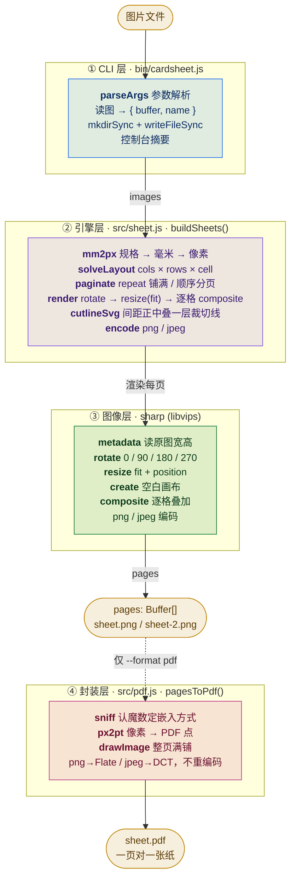

# 架构说明

cardsheet 只有两个运行时依赖：[sharp](https://sharp.pixelplumbing.com/) 做全部图像处理，[pdf-lib](https://pdf-lib.js.org/) 只在 `--format pdf` 时用上。版面逻辑压在一个约 195 行的排版引擎里，没有插件系统、没有中间层服务。
所以这里的「架构」重点不是模块划分，而是**三件事**：坐标与单位的约定、版面是怎么算出来的、以及每一步的输入输出。

> 本文件是架构图的**源**。图由 [Mermaid](https://mermaid.js.org/) 生成，GitHub 上直接渲染；离线查看或需要矢量图时按文末的 [导出 SVG](#导出-svg) 生成 `docs/architecture.svg`。

## 总览



**边界约定**：CLI 层不认识毫米，引擎层不认识文件系统。
`buildSheets` 的输入已经是 `Buffer`、输出是 `Buffer[]`，中间不碰磁盘 —— 这样引擎能直接嵌进别的程序（Web 服务、Electron、另一个 CLI）而不必改一行。
引擎另外还导出 `resolvePaper` / `PAPERS` / `mm2px`，供外部自己拼版面。

**为什么 PDF 单独一层（第 ④ 层）**：排版和容器格式是两件事 —— 引擎只回答「像素怎么摆」，
`pagesToPdf` 只回答「这些像素怎么装进一个文件」。把 PDF 塞进 `buildSheets` 会让它的返回值
一会儿是 `Buffer[]` 一会儿是「一个 PDF Buffer」，契约变模糊；反过来，想加 TIFF/PS 也不用碰版面算法。
这层是纯格式转换，不含任何几何知识。

## 坐标系与单位

这是全项目唯一容易出错的地方，所以单独拎出来。

| 层 | 单位 | 说明 |
| --- | --- | --- |
| 命令行 | **毫米** | `--cell 86x54`、`--gap 2`、`--margin 5`、`--paper a4` 全是毫米 |
| 引擎内部 | **像素** | 进入 `buildSheets` 第一个动作就是把所有毫米过一遍 `mm2px()` |
| 输出 | **像素 + 毫米** | 返回 `cellW/cellH` 是像素，由 CLI 用 `cellW / dpi * 25.4` 反算毫米打印 |

```js
mm2px = (mm, dpi) => Math.max(1, Math.round(mm / 25.4 * dpi))
```

- 换算**只在入口做一次**，引擎内部不再出现毫米，避免舍入误差在几何里累积。
- dpi 被夹在 `[36, 1200]`：`--dpi 0` 不会除出 `Infinity`，也不会因为手滑把内存打爆。
- 单元格边长夹在 `>= 8px`、可用版面夹在 `>= 20px`，越界直接抛错而不是画出一张全白的纸。

## 版面求解

`cols / rows / cell` 三者的给法决定了求解顺序，这是引擎里唯一带分支的算法。
四条路径按 `--cell` → `--cols --rows` → 二选一 → 都不给 的优先级短路：


**全自动为什么这样选**：用户只给了一堆图和一个纸张，想要的是「一页塞最多」。
枚举列数、每种列数按首图宽高比推出行数，取乘积最大者；单元格最窄限制 15mm，否则一张横图会被排成 1×20 这样的畸形版。
并列时**保留列少的那个**（`c * r > best.count` 是严格大于），因为列少 = 每张占的横向面积更大，裁切后尺寸更接近原图预期。

这里的「首图宽高比」是**旋转之后**的宽高比 —— 见[渲染管线](#渲染管线)里 `aspectOf` 那段。

> **为什么这个循环不做提前退出 / 不从多到少枚举。**
> 试过把枚举反过来（`c` 从 `maxCols` 递减，声称「撞到最优解就退出」），两个问题：
> 一是并没有 `break`，循环照样跑满区间，计算量一分没省；二是方向一反转，「严格大于保留先遇到的」就从「并列取列少」悄悄变成「并列取列多」，和代码里自己的注释、也和上面的文档全部对不上。
>
> 更根本的是提前退出在这里没有收益：`count` 在整个区间内单调递增（列越多 → 单元格越窄 → 每页张数越多），最优解永远在末位 `c = maxCols`。整段枚举只有几十次，省不下什么；而退出条件要敢信，就得先把单调性证明一遍。反过来从少到多枚举，还顺带把「并列取列少」这个语义保住。
>
> 顺带一提：因为 `minCell = 15mm` 把 `maxCols` 摁在够小的范围内，实测 7 种纸张 × 6 档 dpi × 4 档边距 × 5 档间距 × 120 种宽高比共 100800 种组合，**一次并列都没出现**。所以上面那个方向反转是潜在不一致，不是现网 bug —— 但注释必须和代码一致，否则下一个人会照着注释改代码，改出真 bug。

**为什么 `--cols 2 --rows 5` 的单元格是平分而不是按图缩放**：给了行列就意味着用户要的是「固定 2×5 的版面」，图片之间的差异由 contain 的留白吸收。反过来给了 `--cell` 就是「尺寸优先」，行列是结果不是目的。

## 渲染管线

每一页是一次独立的 `sharp` 合成，**页与页之间不共享中间结果** —— 这样 100 页和 1 页的内存占用是同一量级。

```
① 逐图 .rotate(0|90|180|270)
      ↑ 0 时整步跳过。sharp 的流水线固定是 rotate 在 resize 之前，
        所以「先转再缩」是自然顺序，不用自己换缓冲区
② .resize(cellW, cellH, { fit, position, background })
      fit=contain 横图进竖格、竖图进横格都自动适配，多余部分填成页面底色
      fit=cover 铺满格子并裁掉溢出，position 决定裁哪一边
      fit=fill  拉伸变形铺满（明知会变形时才用）
③ sharp({ create: { width: pw, height: ph, channels: 3, background } })
      ↑ 先铺一张整页底色，格子外的留白和图片 contain 后的空隙因此是同色
④ composite([...逐格 { input, left, top }])
      left = margin + col * (cellW + gap)
      top  = margin + row * (cellH + gap)
⑤ 若 --cutlines，末尾再 composite 一张整页 SVG
⑥ .png() / .jpeg({ quality })
```

**旋转必须同时改版面求解**：这是「先转再缩」带出来的一个连带要求。
自动排布拿首图宽高比来推单元格，如果转了 90°/270° 而宽高比没跟着互换，
排出来的格子仍是按原朝向算的 —— 一张竖图转成横的之后会被塞进一排细高格子里。
所以 `aspectOf(meta, rotate)` 在 90/270 时把宽高换过来再返回，两处求解路径都走它。
测试里断言的正是这条：*横图转 90° 后的版面必须和直接喂竖图时一模一样*。

**为什么旋转是全局的、不做 `图.png:90` 逐图语法**：Windows 盘符带冒号（`C:\a.png`），
`:` 一旦同时承担「路径分隔」和「角度」两种含义，就得靠一堆启发式规则去猜。
工具宁可少一个语法，也不用让用户猜一个路径到底被当成了什么。
要逐张不同朝向，分两次跑、各自 `--rotate`，输出的 `-2` 后缀天然区分。

**裁切线为什么用 SVG `<rect>` 而不是 `<line>`**：线宽按 `dpi / 150` 算（约 0.17mm），再 `Math.round` 成整数像素后画成矩形。
直接 stroke 一条 1px 线会被抗锯齿稀释成半透明，打印出来几乎看不见；画成实心矩形则保证落到纸上是一条实实在在的浅灰线。

**裁切线只画在间距正中**：位置是 `margin + c·(cellW + gap) - gap / 2`。
这意味着 `--gap 0` 时线画在格子边界上（`gap/2 = 0`），此时线条会压在图片上，需要注意。

## PDF 封装

`--format pdf` 时引擎照旧出页面图像，再由 `src/pdf.js` 装进一个文件：

```
pages: Buffer[]  ──sniff 魔数──▶  embedPng / embedJpg  ──drawImage──▶  sheet.pdf
                     │                  │
                     │                  └─ PNG → FlateDecode，JPEG → DCTDecode（都是 PDF 原生支持的编码）
                     └─ 按内容认类型，不看调用方给的文件名
```

**页面尺寸怎么来的**。PDF 的用户单位是 1/72 英寸，而引擎里的像素是按 dpi 定义的，
所以 `1px = 72/dpi pt`（`px2pt`）。A4 @300dpi 的 2480×3508px 就是 595.2×843.4pt —— 和标称 A4 的 210×297mm 对得上。
整套「毫米 ↔ 像素 ↔ 点」的换算只在边界上做这一次，中间没有第二次舍入。

**为什么不重新编码**。如果把每页 PNG 解码再压成 JPEG 塞进 PDF，就是一次纯粹有损的往返。
PDF 1.x 本来就能直接装 DCTDecode（JPEG）和 Flate（PNG），所以这里按魔数分派、不做任何转码：
少一次画质损失，也少一份内存峰值。代价是 PNG 页面在 PDF 里会比较大 —— 所以 CLI 在 PDF 模式下
让引擎出 jpeg（`--quality` 控制），正好落在 PDF 体积最小的那个编码上。

**整页满铺，不翻转**。PDF 原点在左下角、y 轴朝上，图像 y 轴朝下。
因为每张图都是整页铺满、正好等于页面尺寸，`drawImage({ x: 0, y: 0, w, h })` 得到的正负号影响不到结果，
所以不需要额外做一次上下翻转 —— 这也是为什么这层能保持「零几何知识」。

## 目录结构

```
bin/cardsheet.js    CLI 入口：参数解析 → 调引擎 → 写文件 → 打印摘要
src/index.js        包主入口，把 sheet 与 pdf 再导出一次
src/sheet.js        排版引擎，全部版面逻辑；导出 buildSheets / resolvePaper / PAPERS / mm2px
src/pdf.js          PDF 封装，只做格式转换；导出 pagesToPdf / px2pt
test/smoke.js       冒烟测试：引擎直调 9 组 + CLI 全链路 2 组，逐像素断言
docs/               架构文档与图
```

引擎没有内部状态，`buildSheets` 可以并发调用。CLI 与引擎之间只有 `buildSheets` 一个契约 —— 换前端、换 UI、加 Web 面板都不需要动 `src/sheet.js`。

## 对外 API

```js
const { buildSheets, resolvePaper, PAPERS, mm2px } = require('cardsheet/src/sheet');

const r = await buildSheets({
  images: [{ buffer, name }],   // 必填，顺序即排布顺序
  paper: 'a4',                  // 预设名 或 '宽x高'(毫米)
  dpi: 300,
  landscape: false,
  cols: null, rows: null,       // 与 cell 的优先级见上文决策树
  cell: null,
  gap: 2, margin: 5,            // 毫米
  repeat: false, cutlines: false,
  rotate: 0,                    // 0 / 90 / 180 / 270，版面按转完的朝向重算
  fit: 'contain',               // contain / cover / fill
  position: 'centre',           // top / left bottom / entropy …
  background: '#ffffff',
  format: 'png', quality: 90,
});

// → { pages: Buffer[], pageW, pageH, cols, rows, cellW, cellH, perPage, pageCount, dpi }
```

要 PDF 再走一步，两层是分开的：

```js
const { pagesToPdf } = require('cardsheet');
const pdf = await pagesToPdf(r.pages, { width: r.pageW, height: r.pageH, dpi: r.dpi });
// → Buffer，一个 PDF 文件，页数 = r.pages.length，页面尺寸 = 纸张实尺
```

`pages` 是 `Buffer[]`，按 `pages[0]`、`pages[1]`… 顺序对应第 1、2 页。返回的 `cellW/cellH` 是像素，除以 `dpi` 再乘 25.4 就是毫米 —— 这也是 CLI 摘要那行的算法。

## 导出 SVG

仓库里已包含 `docs/architecture.svg` / `architecture-light.svg` 与 `docs/layout.svg` / `layout-light.svg`（暗 / 亮两套配色），由本文件的 Mermaid 块生成。
改了图之后重新生成：

```bash
npm run docs
```

**改图只需要改本文件的 Mermaid 代码块**，不要直接编辑 `docs/*.svg` —— 那些是产物，下次生成会被覆盖。
